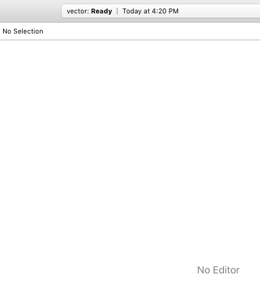
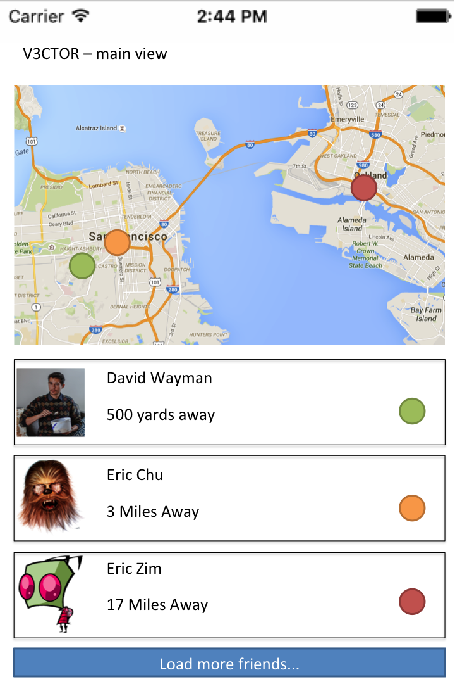
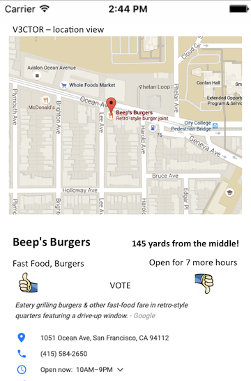
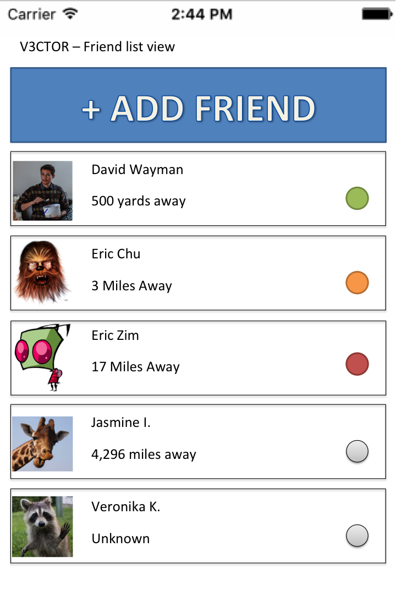

# Group Project - Vector

Vector is an interface to find a place to meet between two points of location.

Time spent: **7** mythical man hours spent in total

## User Stories

The following **required** functionality is completed:

- [x] User can get current location
- [ ] User can get input a friend's location & get a midpoint
- [ ] User can get friends location from a list of friends
- [ ] User can choose the type of meeting point (ex: bar, coffee shop, library).
- [x] User can pull a list of businesses around a radius of the meeting point.
- [ ] Users can access detailed view of midpoint location(s)
- [ ] User account persists through app restarts

The following **optional** features are implemented:

- [ ] User can adjust midpoint based on time and/or distance
- [ ] User can can choose method of transportation.
- [ ] Friends locations update based on their GPS location

Please list two areas of the assignment you'd like to **discuss further with your peers** during the next class (examples include better ways to implement something, how to extend your app in certain ways, etc):

1. Using Google Map API
2. Integrating multiple API datasets into a single "stream" of user info

## Video Walkthrough 

Here's a walkthrough of implemented user stories:



GIF created with[LiceCap](http://www.cockos.com/licecap/). 

## Wireframes

### Main View

Default view allows interaction with the local area and nearest friends.



### Location Details View

When a location is selected along the vector between two friends.



### Friends List View

Tap the more friends button to access the full list of friends.



### Data Schema

#### User Model:
```
 var owner: PFUser?
 var userName: String?
 var profilePicture: UIImage?
 var phone: String?
 var latitude: Double?
 var longitude: Double?
 var destination: String?
 var friends: [String]?
 var friendRequest: [String]?
 var friendAdd: [String]?
```

## Notes

Describe any challenges encountered while building the app.

## Data Model

- Google Maps API: coordinate.longitude, coordinate.latitude
- Google Places API: name, vicinity, geometry.location.lat, geometry.location.lng, placeType, photos

## License #

    Copyright 2016 [name of copyright owner]

    Licensed under the Apache License, Version 2.0 (the "License");
    you may not use this file except in compliance with the License.
    You may obtain a copy of the License at

        http://www.apache.org/licenses/LICENSE-2.0

    Unless required by applicable law or agreed to in writing, software
    distributed under the License is distributed on an "AS IS" BASIS,
    WITHOUT WARRANTIES OR CONDITIONS OF ANY KIND, either express or implied.
    See the License for the specific language governing permissions and
    limitations under the License.
